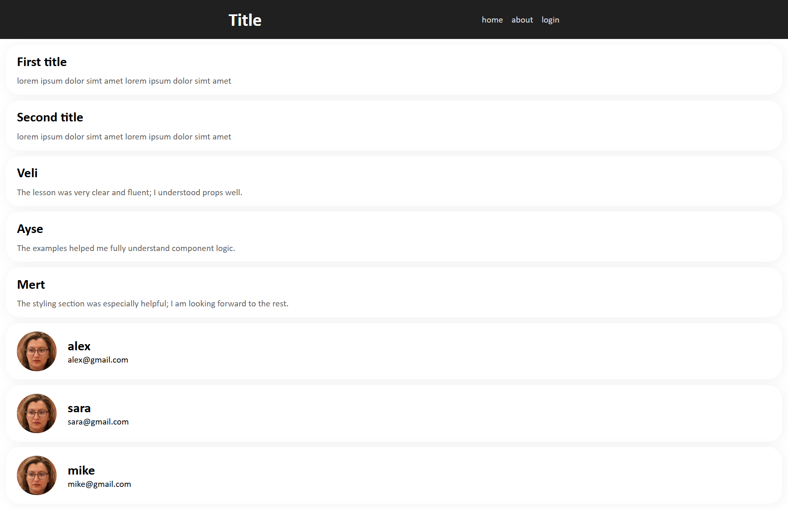
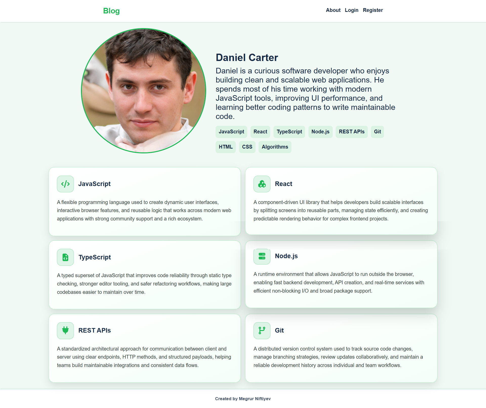
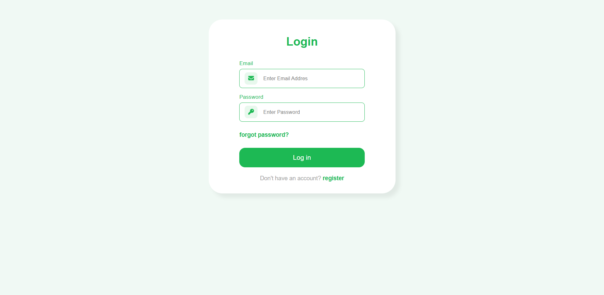
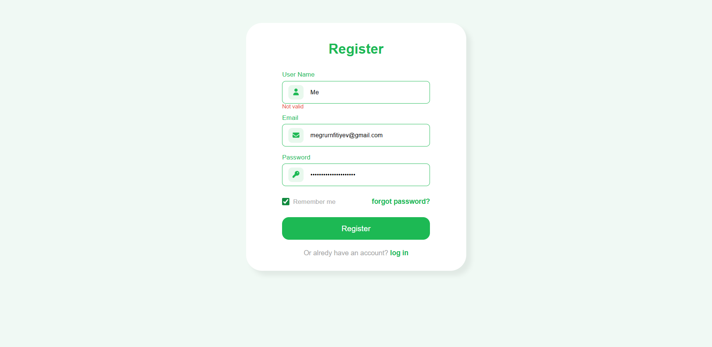

# React Learn

This repository contains demo projects I built while learning React.
I document each newly learned concept in commit messages.

## Repository Structure

- `intro-dependencies,props,styling` - React introduction, component basics, `props`, and basic styling.
- `virtualDom, usestate, functionality` - Virtual DOM, `useState`, routing, and functional pages (blog/login/register).

## Screenshots

### 1) Intro, Dependencies, Props, Styling

  

### 2) Virtual DOM, useState, Functionality

  
  

  

